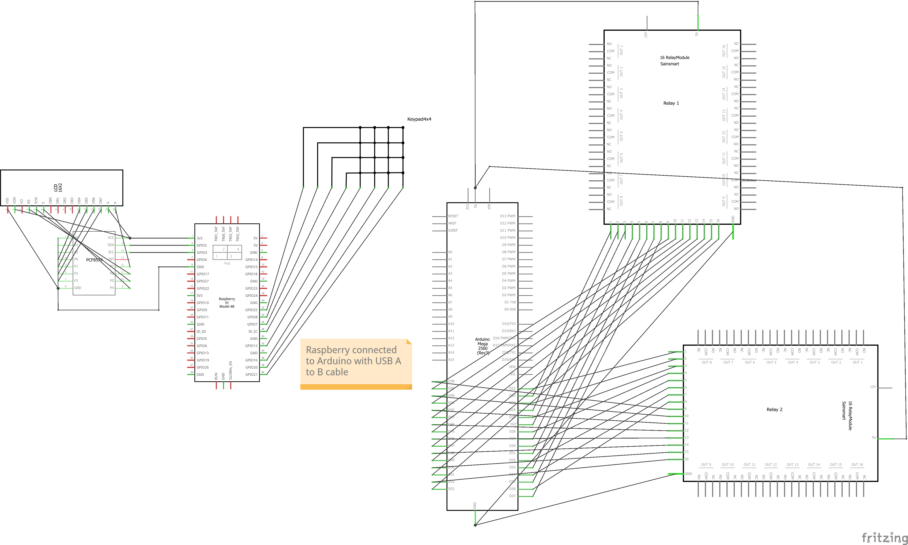
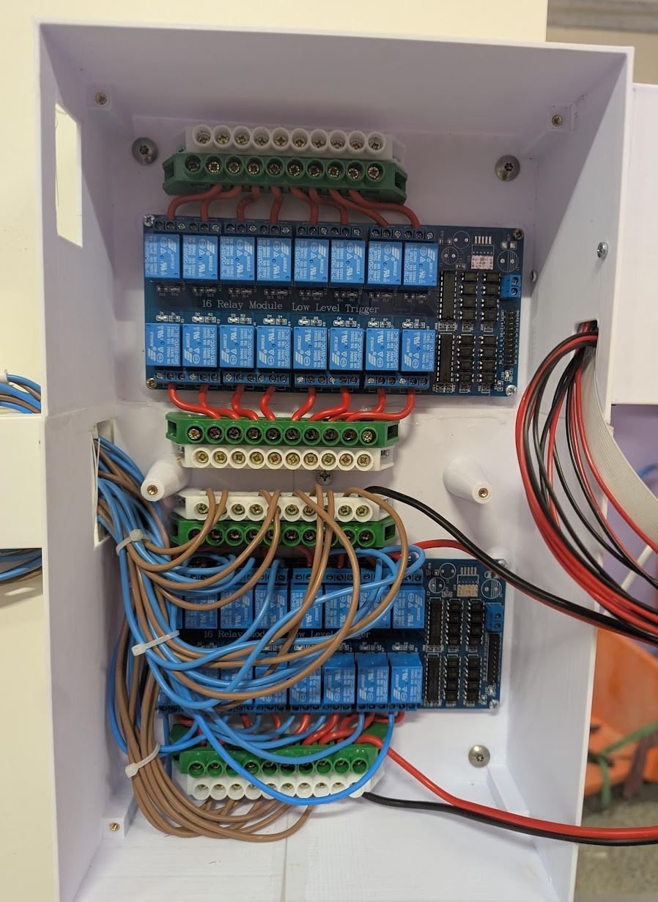
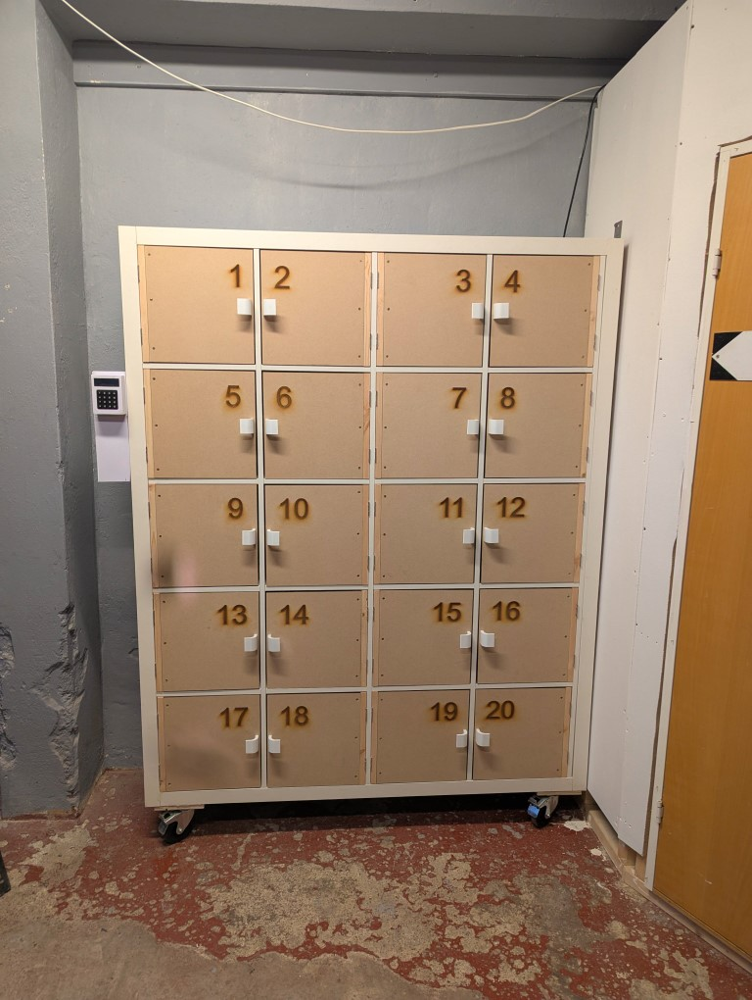

# FELLES Sykkeldelautomat

### *Documentation is still Work in Progress*

## Overview
This repository contains the files and instructions needed to build your own **Sykkeldelautomat** (bike part vending machine) or to maintain the one at FELLES SykkelLab.

The Sykkeldelautomat is constructed from an IKEA Kallax shelf, modified with doors equipped with 12V cabinet locks. These locks are controlled by relay boards, which are driven by an Arduino Mega. The Arduino, in turn, is connected to a Raspberry Pi via USB Serial.

Items are ordered through the [BergenFellesverksted.no](https://bergenfellesverksted.no) WooCommerce online store. When an item belongs to the Sykkeldelautomat category, a pickup code is automatically sent to the buyer. Additionally, each item is assigned a door using a WooCommerce `attribute` formatted as `door = NN`.

## Online Setup
The online system handles the assignment of pickup codes and manages order data. Here’s how it works:

- **Pickup Code Assignment:**  
  - Orders in the Sykkeldelautomat category are automatically assigned a pickup code.
  - Equipment booked through Bookly in the SykkelLab service receives both pickup and delivery codes.

- **WordPress Integration:**  
  To enable these features, include the functions from `website-api/functions.php` in your WordPress `functions.php`.

- **API Communication:**  
  A custom API (code available in the `website-api` folder) facilitates communication between the Raspberry Pi and your website. It:
  - Retrieves new orders.
  - Reads pickup codes stored in the `wpia_postmeta` table.
  - Saves pickup confirmation dates sent from the Raspberry Pi.
  - Displays a login-protected table of orders and pickup times.

> **Important:** For Bookly items: Ensure that the "Staff member" name in WooCommerce exactly matches the item name in WooCommerce. The system uses these names to associate orders with the correct door (via the `door` attribute).

## Hardware Overview
The core hardware components include:

- **Raspberry Pi 3B+:**  
  - Runs all services and communicates with the online API.
  - Directly connects to an LCD module and a 4x4 keypad.
  - Interfaces with the Arduino Mega via USB Serial.

- **Arduino Mega 2560:**  
  - Receives commands from the Raspberry Pi over serial.
  - Controls the relay boards to activate the cabinet locks.

Below is the system schematic:

## Pinouts

### Raspberry Pi to I2C LCD
- **Raspberry Pi** → **I2C LCD**
  - 3.3V  → VCC
  - GND   → GND
  - GPIO 2 → SDA
  - GPIO 3 → SDL

### Raspberry Pi to 4x4 Keypad
*(Pin 1 is on the left when viewed from the front)*

- **Raspberry Pi** → **4x4 Keypad**
  - GPIO 21 → 1 (col4)
  - GPIO 20 → 2 (col3)
  - GPIO 16 → 3 (col2)
  - GPIO 12 → 4 (col1)
  - GPIO 1  → 5 (row4)
  - GPIO 7  → 6 (row3)
  - GPIO 8  → 7 (row2)
  - GPIO 25 → 8 (row1)

## Arduino Mega 2560 to Relay Boards Pinout

### Relay Board 1 (Channels 1–16)
- **Arduino Mega 2560** → **Relay Board 1**
  - 23 → Channel 1
  - 25 → Channel 2
  - 27 → Channel 3
  - 29 → Channel 4
  - 31 → Channel 5
  - 33 → Channel 6
  - 35 → Channel 7
  - 37 → Channel 8
  - 39 → Channel 9
  - 41 → Channel 10
  - 43 → Channel 11
  - 45 → Channel 12
  - 47 → Channel 13
  - 49 → Channel 14
  - 51 → Channel 15
  - 53 → Channel 16

### Relay Board 2 (Channels 1–16)
- **Arduino Mega 2560** → **Relay Board 2**
  - 22 → Channel 1
  - 24 → Channel 2
  - 26 → Channel 3
  - 28 → Channel 4
  - 30 → Channel 5
  - 32 → Channel 6
  - 34 → Channel 7
  - 36 → Channel 8
  - 38 → Channel 9
  - 40 → Channel 10
  - 42 → Channel 11
  - 44 → Channel 12
  - 46 → Channel 13
  - 48 → Channel 14
  - 50 → Channel 15
  - 52 → Channel 16

## Relay Boards & Pinout
The system features **two 16-channel relay boards** housed in the enclosure:

- **Relay Board 1 (Bottom of Enclosure):**  
  - **Door 1:** Arduino Mega pin 23  
  - **Door 2:** Arduino Mega pin 25  
  - **Door 3:** Arduino Mega pin 27  
  - *(and so on…)*

- **Relay Board 2 (Top of Enclosure):**  
  - **Door 17:** Arduino Mega pin 22  
  - **Door 18:** Arduino Mega pin 24  
  - **Door 19:** Arduino Mega pin 26  
  - **Door 20:** Arduino Mega pin 28  
  - **Unused Channels:** Arduino Mega pins 30-52 (even numbers)

Refer to the image below for a visual overview of the relay boards:

And here’s an image of the finished installation:

